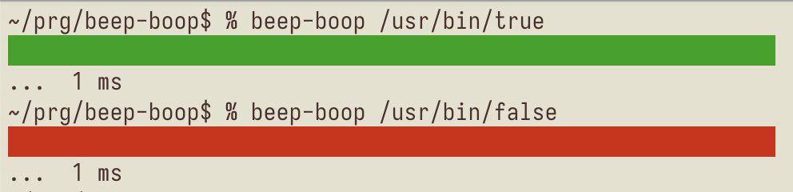

# beep-boop 🤖

**Audible and visual feedback for test runs**



🎶 plays different [pillsbury sounds (from boot)](https://github.com/boot-clj/boot/tree/74edbeb414886ad61de8bbf6f654da33b114e239/boot/worker/src/boot/notify) when a shell command succeeds or fails e.g. run a test.

## Installation

1. Install [bbin](https://github.com/babashka/bbin)
2. `bbin install io.github.logseq-cldwalker/beep-boop`

## Usage

Use `beep-boop` as a wrapper command to envelop your test runner:

```
watchexec -- beep-boop npm test
```

or

```
watchexec -- beep-boop lein test
```

Turn your audio volume up so you can hear the sound!
